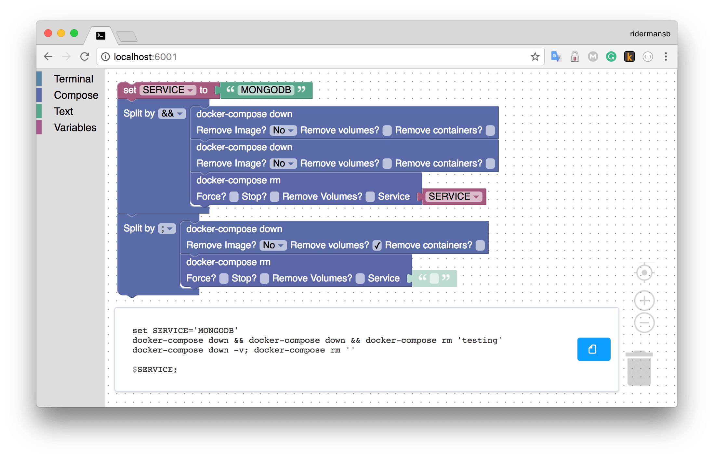

> Blockly that generate shell commands.

## TODO

[0]: https://chrome.google.com/webstore/detail/coding-with-chrome/becloognjehhioodmnimnehjcibkloed
[1]: https://github.com/google/coding-with-chrome/blob/2d4dcb32319225b004de58a6e1edd0f8d23a81b1/src/blocks/sphero/javascript.js
[2]: https://github.com/google/coding-with-chrome/blob/68cf315e3ca5383ca90f1edcb56165e1a2cbb812/src/frameworks/internal/sphero/sphero.js#L105
[3]: https://github.com/google/coding-with-chrome/blob/2d4dcb32319225b004de58a6e1edd0f8d23a81b1/src/blocks/sphero/javascript.js
[4]: https://github.com/google/coding-with-chrome/blob/2d4dcb32319225b004de58a6e1edd0f8d23a81b1/src/frameworks/internal/sphero/sphero.js
